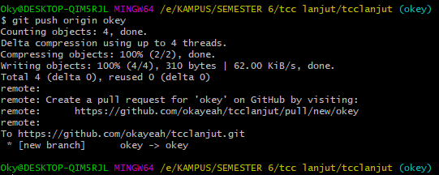

# Pull Request di GIT

- Buat Folder Baru minggu-02

- Buat Branch Baru Lewat Git Bash dengan nama okey dengan 'git branch okey'
- Dilakukan pengecekan branch (sudah terdapat 2 branch yaitu master dan okey) dengan 'git branch'
- Selanjutnya dilakukan perpindahan branch dari master ke okey dengan 'git checkout okey'

- Kemudian menambahkan file README.md dengan 'git add minggu-02/README.md'

- Setelah itu di commit dengan memberikan keterangan 'tambah file' dengan git commit -m "tambah file"

- Setelah di commit lalu di push ke branch okey dengan 'git push origin okey'

- Pada GUI muncul hasil dari pembuatan pull request pada branch okey

- Tampilan dari pull request di GIT

- Selanjutnya di pilih merge pull request

- Pilih merge confirm untuk menggabungkan apa yang ditambahkan pada branch okey ke branch master

- Pemberitahuan bahwa pull request telah sukses di merge

- Tampilan branch master setelah di pull request (terdapat tambahan file minggu-02)

