# Belajar Katacoda

- Buat Folder Baru minggu-03
- Buka katacoda.com kemudian login
- Kerjakan Course Docker & Container Skenario 1 - 3

- Skenario 1

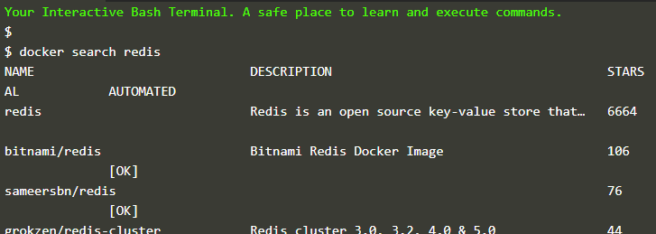

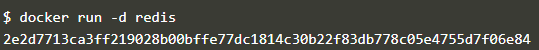

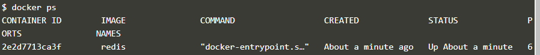

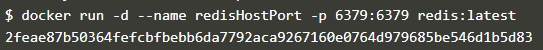

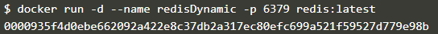

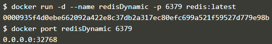

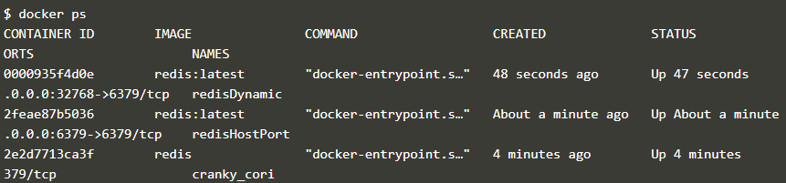

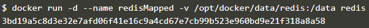

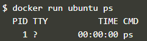

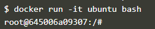

- Skenario 2

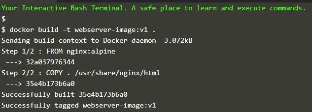

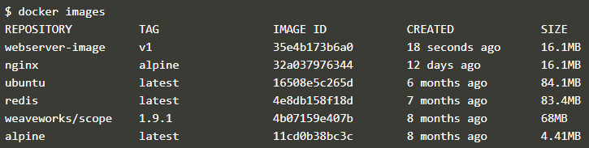

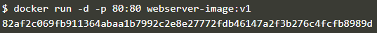

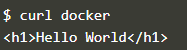

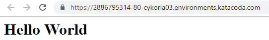

- Skenario 3

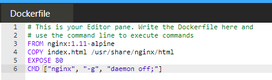

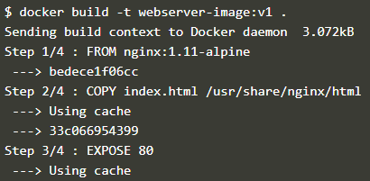

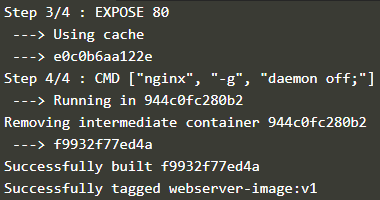

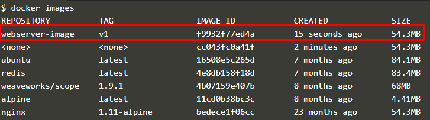

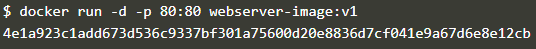

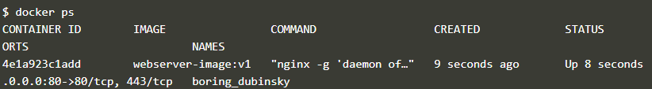

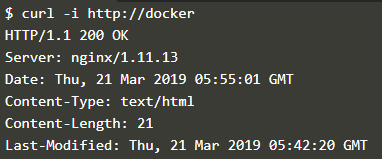

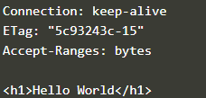